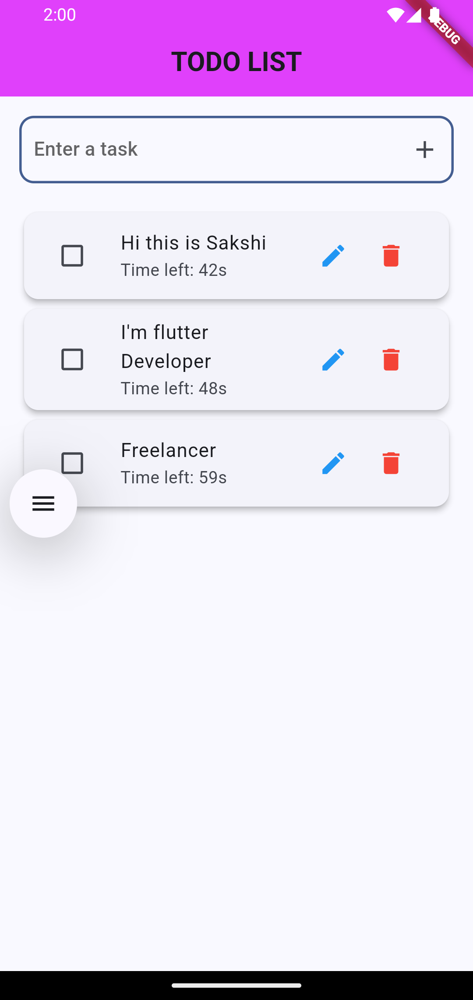

# 📝 Flutter TODO List App

A sleek and modern TODO list app built with Flutter. This app allows users to add, edit, complete, and delete tasks with an automatic countdown timer for each task.

## 🚀 Features

- 📌 Add tasks with a countdown timer (60s auto-delete feature)
- ✏️ Edit tasks seamlessly
- ✅ Mark tasks as completed
- 🗑️ Delete tasks manually
- ⏳ Real-time countdown timer displayed for each task
- 🎨 Beautiful and responsive UI with Material Design

## 📸 Screenshots & 🎥 Demo

<div>
  
</div>

## 🛠️ Installation

1. Clone the repository:
   ```sh
   git clone https://github.com/TutorialsAndroid/TODO-App-Flutter-Android.git
   ```
2. Navigate to the project directory:
   ```sh
   cd flutter-todo-app
   ```
3. Install dependencies:
   ```sh
   flutter pub get
   ```
4. Run the app:
   ```sh
   flutter run
   ```

## 🔧 Technologies Used

- Flutter
- Dart
- Material Design

## 📜 License

This project is licensed under the MIT License - see the [LICENSE](LICENSE) file for details.

## 💡 Contributing

Contributions are welcome! Feel free to submit a pull request or open an issue to suggest improvements.

## 📬 Contact

For any questions or feedback, reach out via [akshaysunilmasram@yahoo.com].

---
💙 Made with Flutter!

